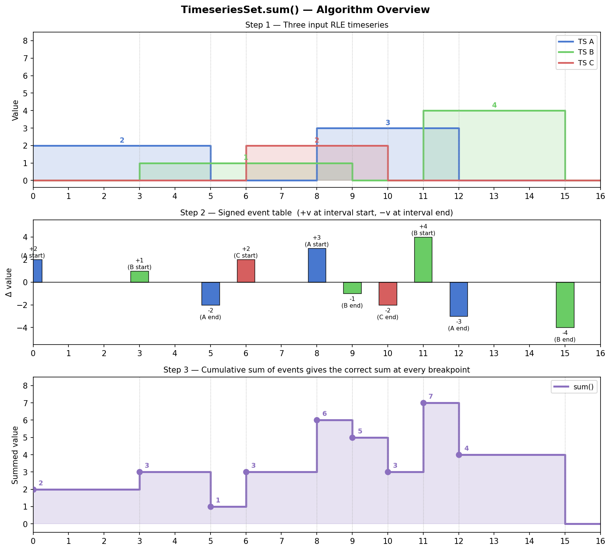
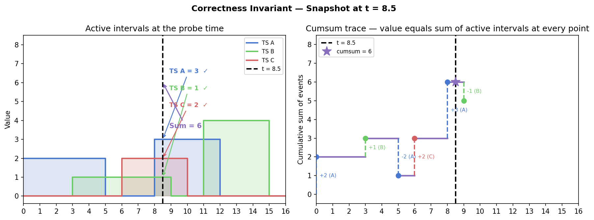
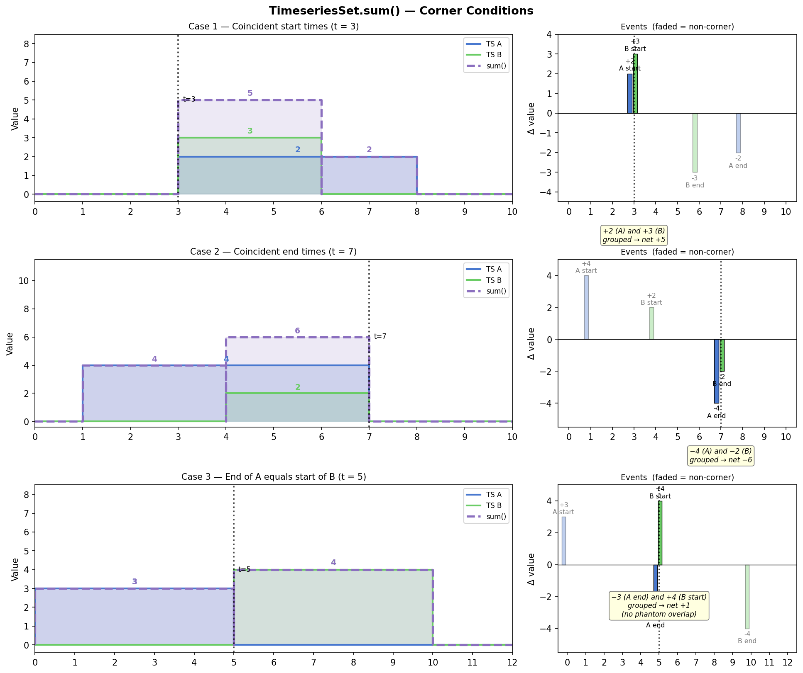
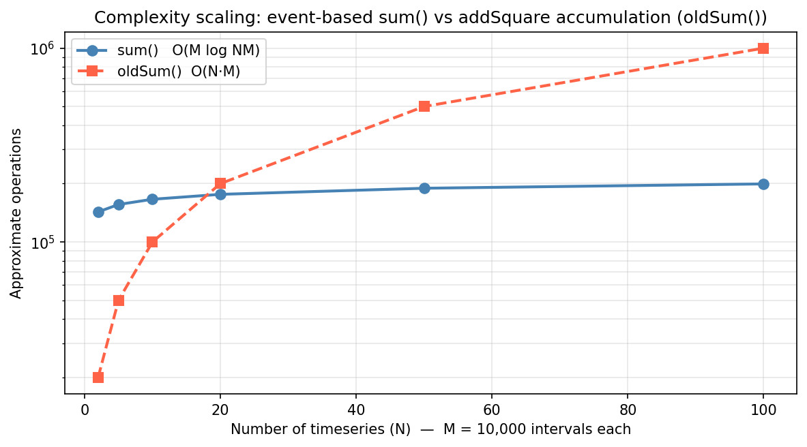

# TimeseriesSet.sum() — Algorithm Exposition

This document gives a self-contained account of the event-based summation algorithm implemented in `TimeseriesSet.sum()` in `Timeseries.py`. It is intended for a reader with a working knowledge of algorithms and data structures who wants to follow the logic, verify the implementation, and be convinced of correctness.

---

## 1. Problem Statement

We are given N timeseries, each represented as a `TimeseriesRLE` — a list of non-overlapping, strictly-positive-duration intervals, sorted by start time, each carrying a constant value. Gaps between intervals implicitly have value zero. The intervals are half-open: `[startTime, endTime)`.

We want to compute their **pointwise sum**: a new `TimeseriesRLE` whose value at every time `t` is exactly the sum of the values of all N input timeseries at `t`.

Formally, let the *i*-th timeseries define a function f_i(t). We want to compute:

```
S(t) = f_1(t) + f_2(t) + ... + f_N(t)
```

where each f_i(t) is a step function — piecewise constant, changing only at its interval endpoints.

---

## 2. Key Observation: Breakpoints

Because each f_i is piecewise constant, S(t) is also piecewise constant. S(t) can only change value at a time where at least one f_i changes value. The set of times where any f_i changes is exactly the union of all interval start times and all interval end times across all N timeseries. Call this set **B** (the breakpoints).

Between any two consecutive breakpoints, every f_i is constant, so S(t) is constant too. This means the output `TimeseriesRLE` has at most |B| − 1 intervals, where |B| ≤ 2·N·M (N timeseries, each with at most M intervals, each contributing a start and an end).

---

## 3. The Signed-Event Representation

The core insight is to represent each interval `[s, e)` with value `v` as two **signed point events**:

- `+v` at time `s` (the interval starts — it "enters" the sum)
- `−v` at time `e` (the interval ends — it "leaves" the sum)

If we collect all such events across all N timeseries, sort them by time, and compute the running cumulative sum of the deltas, the cumsum at any time `t` equals exactly S(t) for `t` in the half-open interval starting at that event's time.

This is the standard **sweep-line** technique from computational geometry: instead of explicitly computing the overlap of N intervals at every point, we process events in time order and maintain a running total.

### Worked Example

Consider three timeseries (see Figure 1):

```
TS A:  [0, 5)  = 2     [8, 12) = 3
TS B:  [3, 9)  = 1     [11, 15) = 4
TS C:  [6, 10) = 2
```

The signed event table is:

| Time | Delta | Source  |
|------|-------|---------|
| 0    | +2    | A start |
| 3    | +1    | B start |
| 5    | −2    | A end   |
| 6    | +2    | C start |
| 8    | +3    | A start |
| 9    | −1    | B end   |
| 10   | −2    | C end   |
| 11   | +4    | B start |
| 12   | −3    | A end   |
| 15   | −4    | B end   |

Computing the cumsum in order:

| Time | Delta | Cumsum | Interval value |
|------|-------|--------|----------------|
| 0    | +2    | 2      | [0, 3) = 2     |
| 3    | +1    | 3      | [3, 5) = 3     |
| 5    | −2    | 1      | [5, 6) = 1     |
| 6    | +2    | 3      | [6, 8) = 3     |
| 8    | +3    | 6      | [8, 9) = 6     |
| 9    | −1    | 5      | [9, 10) = 5    |
| 10   | −2    | 3      | [10, 11) = 3   |
| 11   | +4    | 7      | [11, 12) = 7   |
| 12   | −3    | 4      | [12, 15) = 4   |
| 15   | −4    | 0      | (end)          |

Each cumsum value holds from its event time until the next event time. The output `TimeseriesRLE` has one interval per consecutive pair of breakpoints with nonzero cumsum.



*Figure 1. Top: the three input timeseries. Middle: the signed event table — positive bars at interval starts, negative bars at interval ends, coloured by source timeseries. Bottom: the cumulative sum at each breakpoint, which gives the correct pointwise sum.*

---

## 4. Correctness

**Invariant:** After processing all events up to and including time `t`, the cumsum equals S(t).

**Proof by induction on events:**

*Base case:* Before any events, the cumsum is 0. S(t) = 0 for t < min(all start times). ✓

*Inductive step:* Suppose the cumsum correctly equals S(t) just before some event at time `t*`. The event either:

- Adds `+v` because interval `[t*, e)` begins. From `t*` onward (until the next event), this interval contributes `v` to S. Adding `+v` to the cumsum accounts for exactly this contribution. ✓
- Adds `−v` because interval `[s, t*)` ends. From `t*` onward, this interval no longer contributes to S. Subtracting `v` from the cumsum removes exactly this contribution. ✓

When multiple events share the same time, they are summed together before being applied (via `groupby('time').sum()` in the implementation). This is correct because all such events take effect simultaneously at `t*`.

*Termination:* Every `+v` event has a matching `−v` event (since every interval has both a start and an end). The cumsum therefore returns to 0 after the last event, consistent with S(t) = 0 beyond all interval ends. ✓

### Snapshot verification

Figure 2 illustrates the invariant at `t = 8.5`. At that time, three intervals are active: A = 3, B = 1, C = 2, giving S(8.5) = 6. The cumsum trace on the right reaches exactly 6 at `t = 8.5` via the sequence of events processed up to that point.



*Figure 2. Left: the three timeseries with a vertical probe at t = 8.5, annotating the active intervals. Right: the cumsum trace, showing that it equals the sum of active interval values (6) at the probe time.*

---

## 5. Corner Conditions

The `groupby('time').sum()` step is what correctly handles the boundary cases that a naive implementation would get wrong. Figure 4 illustrates three cases.



*Figure 4. Three corner conditions. Left column: the two input timeseries (A blue, B green) and their sum (purple dashed). Right column: the signed event table with corner-time events highlighted and faded events greyed out.*

**Case 1 — Coincident start times (t = 3)**

TS A and TS B both start at t = 3 with values 2 and 3. The event table contains `+2` and `+3` at the same time. `groupby().sum()` groups them into a single net delta of `+5`, so the cumsum jumps from 0 to 5 in one step. The output correctly has value 5 on [3, 6) — no intermediate phantom value of 2 or 3 appears.

**Case 2 — Coincident end times (t = 7)**

TS A and TS B both end at t = 7. The event table contains `−4` and `−2` at the same time. They group to a net delta of `−6`, dropping the cumsum from 6 to 0 in a single step. The output correctly has no interval after t = 7 — there is no intermediate phantom value of 2 or 4.

**Case 3 — End of A equals start of B (t = 5)**

TS A ends at t = 5 and TS B starts at t = 5. The event table contains `−3` (A end) and `+4` (B start) at the same time. They group to a net delta of `+1`, so the cumsum steps from 3 to 4 at t = 5. The output is [0, 5) = 3, [5, 10) = 4 — exactly the correct values with no overlap and no phantom. A naive implementation that processed start events before end events (or vice versa) at the same time could produce a spurious intermediate value of 0 or 7; grouping prevents this.

In all three cases the key mechanism is identical: simultaneous events are summed atomically before advancing the cumsum. The implementation achieves this with a single `groupby('time').sum()` call, so there is no special-case code needed for any of these situations.

## 6. Complexity

Let M = total number of intervals across all N timeseries (M = Σ m_i).

The event table has exactly 2M rows (one start and one end per interval). Steps:

| Step | Operation | Cost |
|------|-----------|------|
| Build event table | One `pd.DataFrame` per timeseries, two per interval | O(M) |
| Concatenate | `pd.concat` | O(M) |
| Sort and group by time | `groupby('time', sort=True)` | O(M log M) |
| Cumsum | `cumsum()` on at most 2M values | O(M) |
| Filter zero intervals and build output | Boolean mask + `TimeseriesRLE` construction | O(M) |

**Total: O(M log M)**, dominated by the sort.

The `addSquare`-based accumulation (`oldSum`) processes N timeseries one at a time. Each `addSquare` call computes a breakpoint union and samples both timeseries, costing O(k) where k is the current accumulated interval count. After i steps, k ≈ i·m intervals, so the total cost is O(Σ i·m) = **O(N²·M)**. For large N this grows quadratically, while `sum()` is sub-linear in N.



*Figure 3. Operation count (log scale) vs number of timeseries N, for M = 10,000 intervals each. `sum()` (blue, solid) grows nearly flat in N; `oldSum()` (orange, dashed) grows linearly and exceeds `sum()` beyond N ≈ 20.*

Measured throughput on 10 timeseries × 100,000 intervals each (all intervals duration ≥ 1):

| Method | Throughput |
|--------|-----------|
| `sum()` | ~1.4M events/sec |
| `oldSum()` | ~57K events/sec |

Approximately **24× faster** at this scale; the gap widens as N increases.

---

## 7. Annotated Implementation

```python
def sum(self):
    if not self.tsSetList:
        return TimeseriesRLE(pd.DataFrame(columns=['timestamp', 'nextTS', 'tsValue']))

    first = self.tsSetList[0]
    startCol = first.startTimeColName
    endCol   = first.endTimeColName
    valCol   = first.valueColName

    # Build signed-event table.
    # For each interval [s, e) with value v, emit +v at s and -v at e.
    dfs = []
    for singleTS in self.tsSetList:
        df   = singleTS.df
        vals = df[singleTS.valueColName].values
        dfs.append(pd.DataFrame({'time': df[singleTS.startTimeColName].values,
                                 'delta': vals}))          # +v at start
        dfs.append(pd.DataFrame({'time': df[singleTS.endTimeColName].values,
                                 'delta': -vals}))         # -v at end

    eventsDF = pd.concat(dfs, ignore_index=True)

    # Sort and group simultaneous events, then cumsum.
    # groupby with sort=True is O(M log M).
    grouped  = eventsDF.groupby('time', sort=True)['delta'].sum()
    times    = grouped.index.values
    cumsums  = grouped.values.cumsum()

    # Interval [times[i], times[i+1]) has value cumsums[i].
    # The last event restores the cumsum to 0 (no interval after it).
    startTimes    = times[:-1]
    endTimes      = times[1:]
    intervalVals  = cumsums[:-1]

    # Drop near-zero intervals (implicit zeros are not stored).
    # Uses abs < 1e-10 rather than != 0.0 to suppress floating-point residuals
    # that arise when two intervals share an endpoint (see "Floating-point residuals" below).
    nearZeroMask = np.abs(intervalVals) < 1e-10
    mask  = ~nearZeroMask
    outDF = pd.DataFrame({startCol: startTimes[mask],
                          endCol:   endTimes[mask],
                          valCol:   intervalVals[mask]})

    if outDF.empty:
        return TimeseriesRLE(pd.DataFrame(columns=['timestamp', 'nextTS', 'tsValue']))

    return TimeseriesRLE(outDF.reset_index(drop=True),
                         startTimeColName=startCol,
                         endTimeColName=endCol,
                         valueColName=valCol)
```

Key points:

- **Column name preservation** — `startCol`, `endCol`, `valCol` are read from the first timeseries and carried through to the output, so the result has the same column naming convention as its inputs.
- **Simultaneous events** — `groupby('time').sum()` correctly handles the case where multiple intervals start or end at the same time. Their deltas are summed before the cumsum is advanced, so there is never a spurious intermediate value.
- **Zero-duration intervals are forbidden** — `TimeseriesRLE.__init__` raises `MalformedTimeseriesError` if any interval has `endTime <= startTime`. This is essential: a zero-duration interval `[t, t)` would contribute `+v` and `−v` at the same time `t`, which correctly cancel in `groupby().sum()`. However, `sampleSquare` (used by the pairwise arithmetic methods) does not handle them correctly, so the constructor enforces the constraint globally.
- **Floating-point residuals** — when multiple timeseries share an endpoint (e.g., two emitters triggered by the same simulation tick), their `+delta` and `−delta` events land on the same time bucket and should cancel exactly. Due to float64 non-associativity, the cumsum may instead leave a tiny residual (e.g., −1.4e-14) rather than exactly 0. Without filtering, these residuals create phantom intervals spanning the large *gaps* between real events: a gap of 29 million seconds would appear as an interval with value −1.4e-14, corrupting downstream PDFs and CDFs. The threshold `abs < 1e-10` is 4+ orders of magnitude above observed residuals and well below the smallest physically meaningful emission value. Legitimate negative values (e.g., −20.02 in the test suite) are unaffected.

---

## 8. Edge Cases

| Situation | Behaviour |
|-----------|-----------|
| Empty set (`tsSetList = []`) | Returns an empty `TimeseriesRLE` immediately |
| Set containing an empty member | The empty member contributes no events; result is the sum of the remaining members |
| All intervals disjoint | Output is the union of all intervals, each with its original value |
| All intervals identical | Output is a single interval with value N × v |
| Intervals that share an endpoint | Handled exactly: the `+v` of the incoming interval and the `−v` of the outgoing interval at the same time are summed, giving the correct step change |
| Negative values | Handled correctly; the cumsum can go negative |

---

## 9. Relationship to `addSquare` (pairwise arithmetic)

`addSquare` (and the related `subtractSquare`, `multiplySquare`, `divideSquare`) operate on exactly two timeseries at a time via `_arithmeticPrep`. They compute the same breakpoint union but sample both timeseries at every breakpoint using `sampleSquare`, then apply the arithmetic element-wise. This is correct for pairwise operations.

The difference is that `addSquare` must be called N−1 times to sum N timeseries, and each call operates on an increasingly large accumulated result. `TimeseriesSet.sum()` avoids this by processing all N timeseries simultaneously. Use `TimeseriesSet.sum()` whenever summing three or more timeseries.
