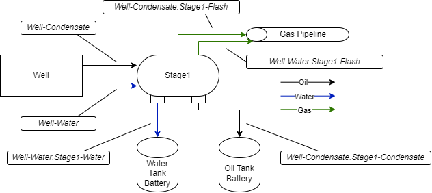

.. _GC-label:

MEET Gas Composition File
=========================

Gas Compositions are conversion factors from a fluid flow rate to speciated components.  Each element in the process flow that transforms the fluid (separators, tanks, flares, etc.) has a separate Gas Composition representing the result of the transformation.  Gas Compositions have a name, created by appending the Flow Tag (defined in the site definition sheet, :ref:`site_definition_label`) and the name of the fluid (Condensate, Water, or Flash) to the end of the Gas Composition the new GC is defined from.  This provides a unique signature of all gas compositions created in the system.

   Gas Composition Naming
   
For example, the above figure defines the following Gas Compositions:

Well-Condensate
  Name of the Gas Composition of the Condensate emerging from the Well.

Well-Water
  Name of the Gas Composition of the Water emerging from the Well.
  
Well-Condensate.Stage1-Flash
  Name of the Gas Composition of the Vapor flashed in Stage1 of the incoming Well-Condensate Gas Composition.

Well-Water-Stage1-Flash
  Name of the Gas Composition of the Vapor flashed in Stage1 of the incoming Well-Water Gas Composition.

Well-Condensate.Stage1-Condensate
  Name of the Gas Composition of the Condensate passed through Stage1 of the incoming Well-Condensate Gas Composition.
  
Well-Water.Stage1-Water
  Name of the Gas Composition of the Water passed through Stage1 of the incoming Well-Water Gas Composition.

Gas Composition File Fields
---------------------------
The Gas Composition file is defined in two blocks -- the metadata section and the GC section.  These blocks are separated by the tag %%%ENDOFMETADATA%%%.  The metadata section contains
fields relevant to the derivation of the values in the GC section, and is used mostly for tracability of results.  None of these values are used directly by the MEET software.

The GC section has the following fields:

MajorEquipment
  The Flow Tag used to define the GC Name for that row.
  
Name
  The name of the Gas Composition (see above)

FluidFlow
  The type of the Fluid Flow this Gas Composition refers to.  Will always be Vapor.

DriveFactorUnits
  Volumetric conversion from fluid flows.  Defined in as a ratio of outbound volume to inbound volume, for example scf/bbl, which is used for converting the Fluid Flow volume 
  (defined in bbl) to a vapor volume (defined in scf).

DriveFactor
  Numeric conversion parameter for Drive Factor volumetric conversion.

GCUnits
  Mass conversion from fluid flows.  Defined as a ratio of outbound mass to inbound volume.

Species Columns (Methane, Ethane, etc.)
  Numeric conversion factor for specific species defined by GCUnits.
   