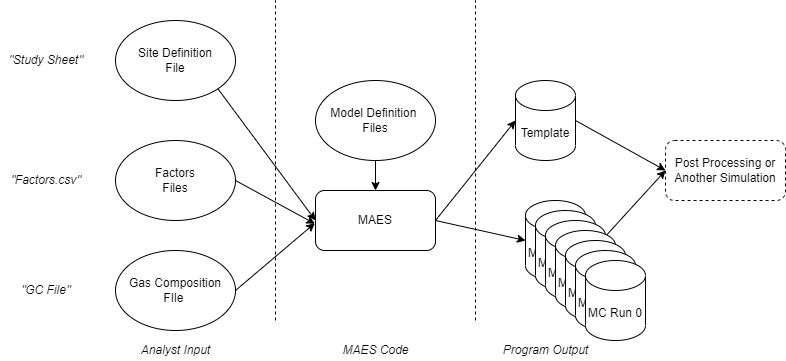

.. _file_format_label:

MEET File Reference
===================

Input Files
-----------
.. toctree::

   Site Definition <siteDefinition>
   Gas Composition <GC>
   Factors <factors>
   
   Distribution Files <distributionFile>

Output Files
------------

All simulation output files get written to a directory of the form {outputRoot}/{studyName}/MC_{scenarioTimestamp}/{MCScenario}, where:

outputRoot
  Defines the root of the output directory to redirect simulation output to a different location for large simulation runs.  Default is "./".  Can be set on the
  command line using the '-or' parameter.
  
studyName
  Name of the scenario definition file (without the .xlsx extension).
  
scenarioTimestamp
  Timestamp of the form YYYYMMDD_hhmmss to easily separate scenario runs.
  
MCScenario
  Monte Carlo scenario number.

   Output File Relationships

.. toctree::
  instantaneousEvents.csv -- Event Log <instantaneousEvents>

  metadata.csv -- Standard metadata for each element <metadata>
  equipment.json -- Element instantiation parameters <equipment>
  secondaryEventInfo.csv -- Additional data for specific events <secondaryEventInfo>
  gasCompositions.csv -- Long-format gas composition values referenced in simulation <gasCompositions>
  fluidFlows.csv -- Fluid Flow definitions <fluidFlows>
  emissionTimeseries.csv -- Fluid Flow rates <emissionTimeseries>
  
Summary Files
-------------

.. toctree::

  summaryEmission.csv -- Emission summary <summaryEmission>
  summaryFluidFlow.csv -- Fluid Flow summary <summaryFluidFlow>
  summaryState.csv -- State timing summary <summaryState>
