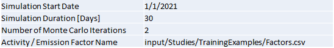
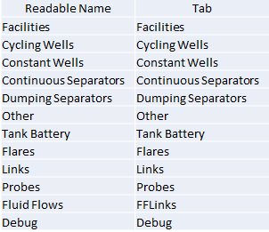

.. _site_definition_label:

MEET Site Definition File
=========================

The site definition file defines all the parameters necessary to run a single simulation.  It is a Microsoft Excel file, with a variable number of tabs
per simulation.  Two tabs are required for every site definition file:

Global Simulation Parameters
  The Global Simulation Parameters tab defines parameters controlling the simulation, and are read directly by the MEET simulation software.
  
  Simulation Start Date
    Defines the start date of the simulation.  Currently not used.
	
  Simulation Duration [Days]
    Length of the simulation.

  Number of Monte Carlo Iterations
    Number of MC iterations for the simulation.  Can be overridden via command line arguments (`-mc`).
	
  Activity / Emission Factor Name
    Name of the random factors file.  If not set, will default to `input/CuratedData/FactorsFileReference/Factors.csv`

   Global Simulation Parameters Tab

Master Equipment
  The Master Equipment tab defines the other tabs in the spreadsheet to be read to define equipment used in the model.

  Readable Name
    Friendly name of the tab.

  Tab
    Name of the tab to be read.
  

   Master Equipment Tab

General Form of Equipment Tabs
------------------------------
Equipment tabs contain columns that fall into the following groups:

Identification Columns
  Identification columns define each individual piece of major equipment.  They name the equipment, define how to model the
  behavior of the equipment, and define its location.
  
  Facility ID
    Facility on which the equipment is located.
	
  Unit ID
    Name of the equipment.  The combination of Facility ID and Unit ID must be unique.

  Model ID
    How the equipment is modelled.  The value is the name of the file defining the model, see :ref:`model_reference_label`

  Latitiude, Longitude
    Physical location of the equipment, if different than the facility definition.  If not specified, use the latitude, longitude defined for the facility.
	
Flow & Factor Columns
  The Flow & Factor columns define how the equipment interacts with the Gas Composition files and the factor files.
  
  Flow Tag
    Identifies which Gas Composition tag to use for emitters off of the equipment.
	
  Leak GC Name
    Identifies which Gas Composition tag to use for leaks off of the equipment.
	
  Factor Tag
    Index into Activity / Emission factor file for this equipment.
	
Model Definition Fields
  The remaining fields in the model definition tab are specific to the particular type of equipment.  See the model definition documentation for the information on these columns.

Special Equipment Tabs
----------------------

Certain equipment tabs have variations on the general form.

Facility tabs
  The facility tab defines general parameters for how the site behaves.
  
  Unit ID
    There is no Unit ID column for the facility tab.
	
  Latitude, Longitude
    The Latitude & Longitude tabs define default locations for equipment defined for the facility.  These values can be overridden as required for sepecific equipment.
	
  Leak Gas Composition
    Default value for gas compositions for leaks for equipment defined on the facility.
	
Wells tabs
  Well model definitions (CycledWell, ContinuousWell) define a gas composition for all gas produced by the well.  This gas composition is carried in the Fluid Flows eminating from the well and
  are used for the processes defined in downstream equipment.
  
FFLinks tabs
  The FFLinks tabs define fluid flow relationships between equipment.

