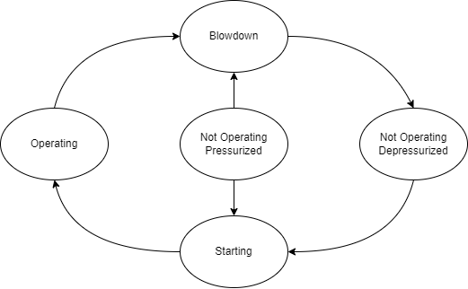

Compressor
==========

Model Filename: Compressor.json

Compressors and VRUS

States
------

OPERATING
  Compressor is operating.

NOT_OPERATING_PRESSURIZED
  Compressor is not operating, but system is still pressurized.

NOT_OPERATING_DEPRESSURIZED
  Compressor is not operating, system is depressurized.

STARTING
  Compressor is starting.

BLOWDOWN
  Compressor is depressurizing.

Fluid Flows
-----------

Vapor
  Output gas from compressor in OPERATING state that goes into production lines.

  *Secondary ID: normal_flow*

Vapor
  Output gas from compressor in NOT_OPERATING_DEPRESSURIZED state intended to be combusted by flare.

  *Secondary ID: flare_flow*

Site Definition Columns
-----------------------

**Facility ID**
  Facility of the equipment

**Unit ID**
  Identity of the equipment

**Compressor Type**
  Type of the compressor

  *Units:* Centrifugal, Reciprocating, Other

**Compressor Power**
  Compressor rated power in kW

  *Units:* kW

**Component Count**
  Number of components in a compressor that may leak

**Starter Event Emission Duration**
  Emissions duration during a starter event

  *Units:* s

**Blowdown Event Duration**
  Duration of a blowdown event

  *Units:* s

**Operating Fraction**
  Fraction of the year the compressor is operating

**NOP Fraction of NOP/NOD**
  Not Operating Pressurized fraction of the fraction of Not Operating duration of the compressor. NOP/NOD Fraction = (1 - Operating Fraction). NOP Fraction = Fraction * (NOP/NOD Fraction)

**Total Duration Lower Limit**
  Lower hours compressor is Operating before going to Not Operating States

  *Units:* hours

**Total Duration Upper Limit**
  Upper hours compressor is Operating before going to Not Operating States

  *Units:* hours

Emitters
--------

**Blowdown Event**
  Emitter Category: TRANSIENT EVENT
  
  Emission Category: VENTED
  
  Model Parameters:
  

    **Blowdown Event Emission Volume**
      Volume of gas emitted during a blowdown event

      *Units:* scf

    **Blowdown Event Duration**
      Duration of a blowdown event

      *Units:* s

    **Factor Tag**
      A parameter to identify a set of activity and emission factors in Factors.csv file

    **Leak GC Name**
      Gas composition pointer for leaks based on pLeak, MTTR, MTBF

**Compressor Blowdown Vent Leak**
  Emitter Category: COMPONENT LEAK
  
  Emission Category: FUGITIVE
  
  Model Parameters:
  

    **Blowdown Vent Component Count**
      Number of blowdown vents

    **Blowdown Vent pLeak**
      Probability of leak on blowdown vents

    **Blowdown Vent MTTRMin**
      Min mean time to repair a blowdown vent

      *Units:* days

    **Blowdown Vent MTTRMax**
      Max mean time to repair a blowdown vent

      *Units:* days

    **Leak GC Name**
      Gas composition pointer for leaks based on pLeak, MTTR, MTBF

    **Factor Tag**
      A parameter to identify a set of activity and emission factors in Factors.csv file

**Compressor Component Leak**
  Emitter Category: COMPONENT LEAK
  
  Emission Category: FUGITIVE
  
  Model Parameters:
  

    **Component Leak Survey Frequency**
      Frequency of leak surveys (ex. LDAR)

      *Units:* days

    **Component Count**
      Number of components in a compressor that may leak

    **Component pLeak**
      Probability of leak of the number of components leaking at any time

    **Leak GC Name**
      Gas composition pointer for leaks based on pLeak, MTTR, MTBF

    **Factor Tag**
      A parameter to identify a set of activity and emission factors in Factors.csv file

**Compressor Pneumatic Emissions**
  Emitter Category: PNEUMATIC EMISSION
  
  Emission Category: VENTED
  
  Model Parameters:
  

    **Leak GC Name**
      Gas composition pointer for leaks based on pLeak, MTTR, MTBF

    **Factor Tag**
      A parameter to identify a set of activity and emission factors in Factors.csv file

    **Actuator Type**
      Actuator type of pneumatics on the facility

      *Units:* Gas, Air, Electric

**Driver Exhaust**
  Emitter Category: EXHAUST
  
  Emission Category: COMBUSTION
  
  Model Parameters:
  

    **Driver Type**
      Type of compressor driver

      *Units:* Turbine, 4SLB, 2SLB, 4SRB, Electric

    **Compressor Power**
      Compressor rated power in kW

      *Units:* kW

    **Driver Type**
      Type of compressor driver

      *Units:* Turbine, 4SLB, 2SLB, 4SRB, Electric

    **Average Loading**
      Average probability for fuel consumption

    **Std Loading**
      Standard deviation for fuel consuption

    **Combustion GC Name**
      Gas composition reference to gc file for compressor combustion emission gas compositions

    **Driver Type**
      Type of compressor driver

      *Units:* Turbine, 4SLB, 2SLB, 4SRB, Electric

    **Engine Efficiency**
      Engine Efficiency

    **Exhaust Factors**
      Reference to species specific destruction efficiencies. User definable. 

**Compressor Dry Seal Large Emitter**
  Emitter Category: COMPONENT LEAK
  
  Emission Category: FUGITIVE
  
  Model Parameters:
  

    **Seal Vent(Large Emitter) Component Count**
      Number of seal vents that may cause large emissions

    **Seal Vent(Large Emitter) pLeak**
      Probability of large emissions on seal vents

    **Seal Vent(Large Emitter) MTTR Min**
      Min mean time to repair seal vent large emissions

      *Units:* days

    **Seal Vent(Large Emitter) MTTR Max**
      Max mean time to repair seal vent large emissions

      *Units:* days

    **Factor Tag**
      A parameter to identify a set of activity and emission factors in Factors.csv file

    **Leak GC Name**
      Gas composition pointer for leaks based on pLeak, MTTR, MTBF

    **Seal Type**
      Type of seals

      *Units:* Dry, Wet, Rod Packing

**Compressor Dry Seal Vent (OP)**
  Emitter Category: VENT
  
  Emission Category: VENTED
  
  Model Parameters:
  

    **Leak GC Name**
      Gas composition pointer for leaks based on pLeak, MTTR, MTBF

    **Factor Tag**
      A parameter to identify a set of activity and emission factors in Factors.csv file

    **Seal Type**
      Type of seals

      *Units:* Dry, Wet, Rod Packing

**Compressor Rod Packing Large Emitter**
  Emitter Category: COMPONENT LEAK
  
  Emission Category: FUGITIVE
  
  Model Parameters:
  

    **Seal Vent(Large Emitter) Component Count**
      Number of seal vents that may cause large emissions

    **Seal Vent(Large Emitter) pLeak**
      Probability of large emissions on seal vents

    **Seal Vent(Large Emitter) MTTR Min**
      Min mean time to repair seal vent large emissions

      *Units:* days

    **Seal Vent(Large Emitter) MTTR Max**
      Max mean time to repair seal vent large emissions

      *Units:* days

    **Factor Tag**
      A parameter to identify a set of activity and emission factors in Factors.csv file

    **Leak GC Name**
      Gas composition pointer for leaks based on pLeak, MTTR, MTBF

    **Seal Type**
      Type of seals

      *Units:* Dry, Wet, Rod Packing

**Compressor Rod Packing Vent (NOD)**
  Emitter Category: COMPONENT LEAK
  
  Emission Category: FUGITIVE
  
  Model Parameters:
  

    **Seal Vent Component Count**
      Number of seal vents that may cause normal emissions

    **Seal Vent pLeak**
      Probability of a seal vent leak

    **Seal Vent MTTR Min**
      Min mean time to repair a regular seal vent emissions

      *Units:* days

    **Seal Vent MTTR Max**
      Max mean time to repair a regular seal vent emissions

      *Units:* days

    **Leak GC Name**
      Gas composition pointer for leaks based on pLeak, MTTR, MTBF

    **Factor Tag**
      A parameter to identify a set of activity and emission factors in Factors.csv file

    **Seal Type**
      Type of seals

      *Units:* Dry, Wet, Rod Packing

**Compressor Rod Packing Vent (NOP)**
  Emitter Category: COMPONENT LEAK
  
  Emission Category: FUGITIVE
  
  Model Parameters:
  

    **Seal Vent Component Count**
      Number of seal vents that may cause normal emissions

    **Seal Vent pLeak**
      Probability of a seal vent leak

    **Seal Vent MTTR Min**
      Min mean time to repair a regular seal vent emissions

      *Units:* days

    **Seal Vent MTTR Max**
      Max mean time to repair a regular seal vent emissions

      *Units:* days

    **Leak GC Name**
      Gas composition pointer for leaks based on pLeak, MTTR, MTBF

    **Factor Tag**
      A parameter to identify a set of activity and emission factors in Factors.csv file

    **Seal Type**
      Type of seals

      *Units:* Dry, Wet, Rod Packing

**Compressor Rod Packing Vent (OP)**
  Emitter Category: VENT
  
  Emission Category: VENTED
  
  Model Parameters:
  

    **Seal Vent Component Count**
      Number of seal vents that may cause normal emissions

    **Seal Vent pLeak**
      Probability of a seal vent leak

    **Seal Vent MTTR Min**
      Min mean time to repair a regular seal vent emissions

      *Units:* days

    **Seal Vent MTTR Max**
      Max mean time to repair a regular seal vent emissions

      *Units:* days

    **Leak GC Name**
      Gas composition pointer for leaks based on pLeak, MTTR, MTBF

    **Factor Tag**
      A parameter to identify a set of activity and emission factors in Factors.csv file

    **Seal Type**
      Type of seals

      *Units:* Dry, Wet, Rod Packing

**Compressor Wet Seal Large Emitter**
  Emitter Category: COMPONENT LEAK
  
  Emission Category: FUGITIVE
  
  Model Parameters:
  

    **Seal Vent(Large Emitter) Component Count**
      Number of seal vents that may cause large emissions

    **Seal Vent(Large Emitter) pLeak**
      Probability of large emissions on seal vents

    **Seal Vent(Large Emitter) MTTR Min**
      Min mean time to repair seal vent large emissions

      *Units:* days

    **Seal Vent(Large Emitter) MTTR Max**
      Max mean time to repair seal vent large emissions

      *Units:* days

    **Factor Tag**
      A parameter to identify a set of activity and emission factors in Factors.csv file

    **Leak GC Name**
      Gas composition pointer for leaks based on pLeak, MTTR, MTBF

    **Seal Type**
      Type of seals

      *Units:* Dry, Wet, Rod Packing

**Compressor Wet Seal Vent (OP)**
  Emitter Category: VENT
  
  Emission Category: VENTED
  
  Model Parameters:
  

    **Leak GC Name**
      Gas composition pointer for leaks based on pLeak, MTTR, MTBF

    **Factor Tag**
      A parameter to identify a set of activity and emission factors in Factors.csv file

    **Seal Type**
      Type of seals

      *Units:* Dry, Wet, Rod Packing

**Compresor Single-Unit Vent Large Emitter**
  Emitter Category: COMPONENT LEAK
  
  Emission Category: FUGITIVE
  
  Model Parameters:
  

    **Common Single-unit Vent(Large Emitter) Component Count**
      Number of single-unit vents that may cause large emissions

    **Common Single-unit Vent(Large Emitter) pLeak**
      Probability of large emissions on a single-unit vent

    **Common Single-unit Vent(Large Emitter) MTTR Min**
      Min mean time to repair large emittors on single-unit vents

      *Units:* days

    **Common Single-unit Vent(Large Emitter) MTTR Max**
      Max mean time to repair large emittors on single-unit vents

      *Units:* days

    **Factor Tag**
      A parameter to identify a set of activity and emission factors in Factors.csv file

    **Leak GC Name**
      Gas composition pointer for leaks based on pLeak, MTTR, MTBF

    **Single Unit Vents**
      A switch to turn on/off single unit vent large emitters

      *Units:* True/False

**Compressor Single-Unit Vent Leak**
  Emitter Category: COMPONENT LEAK
  
  Emission Category: FUGITIVE
  
  Model Parameters:
  

    **Common Single-Unit Vent Component Count**
      Number of single-unit vents that may cause normal emissions

    **Common Single-Unit Vent pLeak**
      Probability of a single unit vent leaking

    **Common Single-unit Vent(Large Emitter) pLeak**
      Probability of large emissions on a single-unit vent

    **Common Single-Unit Vent MTTR Min**
      Min mean time to repair a single unit vent

      *Units:* days

    **Common Single-Unit Vent MTTR Max**
      Max mean time to repair a single unit vent

      *Units:* days

    **Leak GC Name**
      Gas composition pointer for leaks based on pLeak, MTTR, MTBF

    **Factor Tag**
      A parameter to identify a set of activity and emission factors in Factors.csv file

    **Single Unit Vents**
      A switch to turn on/off single unit vent large emitters

      *Units:* True/False

**Leak On Compressor Starter Vent**
  Emitter Category: COMPONENT LEAK
  
  Emission Category: FUGITIVE
  
  Model Parameters:
  

    **Compressor Starter Vent Component Count**
      Number of starter vents

    **Compressor Starter Vent pLeak**
      Probability of a starter vent leaking

    **Compressor Starter Vent MTTR Min**
      Min mean time to repair a starter vent

      *Units:* days

    **Compressor Starter Vent MTTR Max**
      Max mean time to repair a starter vent

      *Units:* days

    **Factor Tag**
      A parameter to identify a set of activity and emission factors in Factors.csv file

    **Leak GC Name**
      Gas composition pointer for leaks based on pLeak, MTTR, MTBF

    **Starter Type**
      Starter type

      *Units:* Gas, Electric, Air

**Start Event**
  Emitter Category: TRANSIENT EVENT
  
  Emission Category: VENTED
  
  Model Parameters:
  

    **Starter Event Emission Volume**
      Emissions volume during a starter event

      *Units:* scf

    **Starter Event Emission Duration**
      Emissions duration during a starter event

      *Units:* s

    **Leak GC Name**
      Gas composition pointer for leaks based on pLeak, MTTR, MTBF

    **Starter Type**
      Starter type

      *Units:* Gas, Electric, Air

.. include:: reference/CompressorReference.rst

.. include:: reference/CompressorEngineLoad.rst

.. include:: reference/CompressorReferenceEpilog.rst
