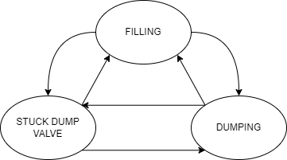

Dumping Separator
=================

Model Filename: DumpingSeparator.json

Separator with volume dependent dump valve

States
------

FILLING
  Separator is filling

DUMPING
  Separator is dumping after reaching a user defined dump volume

STUCK_DUMP_VALVE
  Separator has a stuck dump valve

Fluid Flows
-----------

Vapor
  Condensate flash released to sales

  *Secondary ID: condensate_gas_sales*

Vapor
  Water flash released to sales

  *Secondary ID: water_gas_sales*

Vapor
  Condensate flash released to downstream when dump valve is stuck. Usually this will be 0 but we need to establish a link to anticipate sdv

  *Secondary ID: condensate_flash*

Vapor
  Water Flash released to downstream when dump valve is stuck. Usually this will be 0 but we need to establish a link to anticipate sdv

  *Secondary ID: water_flash*

Water
  Primary Water flow to downstream equipment

  *Secondary ID: primary_water*

Water
  Remaining water to downstream equipment

  *Secondary ID: secondary_water*

Condensate
  Primary Condensate Flow

  *Secondary ID: condensate_flow*

Vapor
  All the gas from upstream, goes to gas sales

  *Secondary ID: gas_sales*

Vapor
  All the gas from upstream if dump valve is stuck, goes to downstream

  *Secondary ID: stuck_dump_valve*

Site Definition Columns
-----------------------

**Facility ID**
  Facility of the equipment

**Unit ID**
  Identity of the equipment

**Component Count**
  Component counts of all the equipment that can leak

**Dump Volume**
  The separator this much volume of liquids

  *Units:* bbl

**Dump Time**
  The separator dumps for this much amount of time. Software will increase this time if inlet flow rates are faster than outlet flow rates and show an error in the console

**Primary Water Takeoff Ratio**
  Specifies a fraction of total water that goes to the primary upstream equipment

**Flow GC Tag**
  Identifies the correct GC from the GC table.

**Stuck Dump Valve Component Count**
  2 phase or 3 phase separator. Not implemented yet.

**Stuck Dump Valve pLeak**
  Probability of the dump valve getting stuck

**Stuck Dump Valve Failure Duration Min**
  Specifies the minimum duration of the dump valve failure (Mean Time To Repair)

  *Units:* days

**Stuck Dump Valve Failure Duration Max**
  Specifies the maximum duration of the dump valve failure (Mean Time To Repair)

  *Units:* days

**Fraction of Flash Released**
  The fraction of all gas in the separator released to the next primary equipment. The remaining gas goes to the gas sales / pipeline. This is a distribution file that selects a random number from the histogram. These are guesses as of now. More data needed.

**Leak GC Name**
  Gas composition pointer for leaks based on pLeak, MTTR, MTBF

Emitters
--------

**Separator Component Leak**
  Emitter Category: COMPONENT LEAK
  
  Emission Category: FUGITIVE
  
  Model Parameters:
  

    **Component Leak Survey Frequency**
      Frequency of leak surveys (ex. LDAR)

      *Units:* days

    **Component Count**
      Component counts of all the equipment that can leak

    **Component pLeak**
      Probability of leak of the number of components leaking at any time

    **Factor Tag**
      A parameter to identify a set of activity and emission factors in Factors.csv file

    **Leak GC Name**
      Gas composition pointer for leaks based on pLeak, MTTR, MTBF

**Separator Pneumatic Emissions**
  Emitter Category: PNEUMATIC EMISSION
  
  Emission Category: VENTED
  
  Model Parameters:
  

    **Leak GC Name**
      Gas composition pointer for leaks based on pLeak, MTTR, MTBF

    **Factor Tag**
      A parameter to identify a set of activity and emission factors in Factors.csv file

    **Actuator Type**
      Actuator type of pneumatics on the facility

      *Units:* Gas, Air, Electric

.. include:: reference/DumpSepRef.rst
