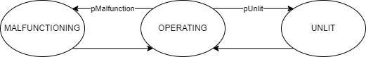

Flare
=====

Model Filename: Flare.json

Equipment that burns waste gas.

States
------

OPERATING
  Flare is operating normally, gas is combusted at maximum efficiency.

MALFUNCTIONING
  Flare is malfunctioning, gas is still combusted at less than maximum efficiency.

UNLIT
  Flare is not lit, gas is vented directly to atmosphere with no combustion.

Fluid Flows
-----------

Vapor
  Fluid Flow for vapor emitted in OPERATING state.  Uses 'Operating Destruction Efficiency' for combustion.

  *Secondary ID: Flare-OPERATING*

Vapor
  Fluid Flow for vapor emitted in UNLIT state.  Uses 'Unlit Destruction Efficiency' for combustion.

  *Secondary ID: Flare-UNLIT*

Vapor
  Fluid Flow for vapor emitted in MALFUNCTIONING state.  Uses 'Malfunction Destruction Efficiency' for combustion.

  *Secondary ID: Flare-MALFUNCTIONING*

Site Definition Columns
-----------------------

**Facility ID**
  Facility of the equipment

**Unit ID**
  Identity of the equipment

**pMalfunction**
  Probability of malfunction of a flare

**Malfunction Duration min**
  Minimum malfunction duration in days

  *Units:* days

**Malfunction Duration max**
  Maximum malfunction duration in days

  *Units:* days

**Malfunction Destruction Efficiency**
  Fraction of entered gas that gets destroyed during a malfunction

**pUnlit**
  Probability of the flare being unlit

**Unlit Duration min**
  Minimum duration of days the flare is unlit

  *Units:* days

**Unlit Duration max**
  Maximum duration of days the flare is unlit

  *Units:* days

**Unlit Destruction Efficiency**
  Fraction of entered gas that gets destroyed when the flare is unlit

**Operating Duration min**
  Minimum days the flares is operating normally

  *Units:* days

**Operating Duration max**
  Maximum days the flares is operating normally

  *Units:* days

**Operating Destruction Efficiency**
  Fraction of the entered gas that gets destroyed when the flares are operating normally

Emitters
--------

**Flare Component Leak**
  Emitter Category: COMPONENT LEAK
  
  Emission Category: FUGITIVE
  
  Model Parameters:
  

    **Component Leak Survey Frequency**
      Frequency of leak surveys (ex. LDAR)

      *Units:* days

    **Component Count**
      Component counts of all the equipment that can leak

    **Component pLeak**
      Probability of leak of the number of components leaking at any time

    **Factor Tag**
      A parameter to identify a set of activity and emission factors in Factors.csv file

    **Leak GC Name**
      Gas composition pointer for leaks based on pLeak, MTTR, MTBF

**Flared Gas Operating**
  Emitter Category: FLARED VENT
  
  Emission Category: COMBUSTION
  
  Model Parameters:
  

**Flared Gas Malfunction**
  Emitter Category: FLARED VENT
  
  Emission Category: COMBUSTION
  
  Model Parameters:
  

**Unflared Gas from Flare**
  Emitter Category: FLARED VENT
  
  Emission Category: COMBUSTION
  
  Model Parameters:
  

.. include:: reference/FlareReference.rst
