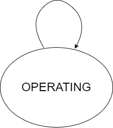

Misc Equipment On Compressor Station
====================================

Model Filename: MiscCompressorStation.json

Misc equipment on a compressor stations

States
------

OPERATING
  Misc equipment are operating based on input parameters

Fluid Flows
-----------

Site Definition Columns
-----------------------

**Facility ID**
  Facility of the equipment

**Unit ID**
  Identity of the equipment

**Component Count**
  Component counts of all the equipment that can leak

Emitters
--------

**Leaks On Other Equipment On Compressor Station**
  Emitter Category: COMPONENT LEAK
  
  Emission Category: FUGITIVE
  
  Model Parameters:
  

    **Component Count**
      Component counts of all the equipment that can leak

    **Component pLeak**
      Probability of leak of the number of components leaking at any time

    **Factor Tag**
      A parameter to identify a set of activity and emission factors in Factors.csv file

    **Component Leak Survey Frequency**
      Frequency of leak surveys (ex. LDAR)

      *Units:* days

    **Leak GC Name**
      Gas composition pointer for leaks based on pLeak, MTTR, MTBF

**Misc Pneumatic Emissions On Compressor Station**
  Emitter Category: PNEUMATIC EMISSION
  
  Emission Category: VENTED
  
  Model Parameters:
  

    **Leak GC Name**
      Gas composition pointer for leaks based on pLeak, MTTR, MTBF

    **Factor Tag**
      A parameter to identify a set of activity and emission factors in Factors.csv file

    **Actuator Type**
      Actuator type of pneumatics on the facility

      *Units:* Gas, Air, Electric

**Compressor Station Common Vent Leak**
  Emitter Category: COMPONENT LEAK
  
  Emission Category: FUGITIVE
  
  Model Parameters:
  

    **Common Facility Vent Component Count**
      Number of common vents

    **Common Facility Vent pLeak**
      Probability of leak on common facility vents

    **Common Facility Vent MTTR Min**
      Minimum days of MTTR on a common vent

      *Units:* days

    **Common Facility Vent MTTR Max**
      Maximum days of MTTR on a common vent

      *Units:* days

    **Factor Tag**
      A parameter to identify a set of activity and emission factors in Factors.csv file

    **Leak GC Name**
      Gas composition pointer for leaks based on pLeak, MTTR, MTBF

    **Facility Common Vent**
      A switch to turn on/off common vent emitters on misc equipment

      *Units:* TRUE/FALSE

**Compressor Station Common Vent Large Emitter**
  Emitter Category: COMPONENT LEAK
  
  Emission Category: FUGITIVE
  
  Model Parameters:
  

    **Facility Vent (Large Emitter) pLeak**
      Probability of leak of large emitters on common vents. Facility Common Vent must be TRUE

    **Facility Vent (Large Emitter) MTTR Min**
      Minimum time to repair a common vent large emitter. Facility Common Vent must be TRUE

      *Units:* days

    **Facility Vent (Large Emitter) MTTR Max**
      Maximum time to repair a common vent large emitter. Facility Common Vent must be TRUE

      *Units:* days

    **Factor Tag**
      A parameter to identify a set of activity and emission factors in Factors.csv file

    **Leak GC Name**
      Gas composition pointer for leaks based on pLeak, MTTR, MTBF

    **Facility Common Vent**
      A switch to turn on/off common vent emitters on misc equipment

      *Units:* TRUE/FALSE

**Compressor Station Components Large Emitter**
  Emitter Category: COMPONENT LEAK
  
  Emission Category: FUGITIVE
  
  Model Parameters:
  

    **Facility Components (Large Emitter) pLeak**
      Probability of leak of large emitters on facility components

    **Facility Components (Large Emitter) MTTR Min**
      Minimum days of MTTR of facility components emitters

      *Units:* days

    **Facility Components (Large Emitter) MTTR Max**
      Maximum days of MTTR of facility components emitters

      *Units:* days

    **Factor Tag**
      A parameter to identify a set of activity and emission factors in Factors.csv file

    **Leak GC Name**
      Gas composition pointer for leaks based on pLeak, MTTR, MTBF

    **Facility Components Large Emitter**
      A switch to turn on/off large emitters on misc equipment

      *Units:* TRUE/FALSE

.. include:: reference/MiscCompressorStationRef.rst
