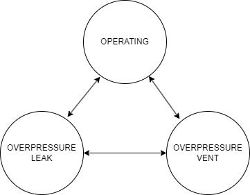

Tank Battery
============

Model Filename: TankBattery.json

Tank Battery is a group of tanks that are used for storing liquids for sale. Tank Batteries are filling most of the time denoted by 'OPERATING' state. Overpressure situation in tanks is modelled as 'OVERPRESSURE_VENT', where excess of gas is released through the prvs. 'OVERPRESSURE_LEAK' refers to accidental opening of the vents leading to leaks.

States
------

OPERATING
  Tank battery operating normally

OVERPRESSURE_LEAK
  Leaks on vents

OVERPRESSURE_VENT
  Emissions due to overpressure

Fluid Flows
-----------

Vapor
  Tank condensate/water flash to flares

  *Secondary ID: tank_flash*

Vapor
  Vapor from upstream (usually from sep) goes to upstream equipment (usually flares)

  *Secondary ID: tank_gas_outlet*

Vapor
  Condensate/water flash goes to prvs, overpressure large emitter. Only used for testing/analysis

  *Secondary ID: tank_flash_emitted_gas*

Vapor
  Vapor from upstream (usually from sep) goes to prv after the threshold, overpressure. Only used for testing/analysis

  *Secondary ID: emitted_gas*

Site Definition Columns
-----------------------

**Battery Type**
  Condensate Tank or Water Tank

**Facility ID**
  Facility of the equipment

**Unit ID**
  Identity of the equipment

**Component Count**
  Component counts of all the equipment that can leak

**Fluid**
  Condensate or Water

**Overpressure Vents Large Emitter pLeak**
  Probability of tanks going into overpressure mode to release the excess pressure through flares or prvs

**Overpressure Vents Large Emitter MTTR min**
  Minimum duration to repair for large emitters caused due to overpressure situation

  *Units:* days

**Overpressure Vents Large Emitter MTTR max**
  Maximum duration to repair for large emitters caused due to overpressure situation

  *Units:* days

**Overpressure Vents Large Emitter Threshold**
  Threshold inlet flow above which the prv starts to open

  *Units:* scfh

**Inlet Flow At Max Primary Flow**
  When inlet flow reaches this value, the primary equipment (ex. flares) receives its maximum flow

  *Units:* scfh

**Max Primary Outlet Flow**
  Maximum flow into the primary equipment from the tanks. The remaining gas goes through the vents/prvs

  *Units:* scfh

Emitters
--------

**Tank Vents Large Emitter**
  Emitter Category: OVERPRESSURE EMITTER
  
  Emission Category: FUGITIVE
  
  Model Parameters:
  

**Tank Thief Hatch Leak**
  Emitter Category: COMPONENT LEAK
  
  Emission Category: FUGITIVE
  
  Model Parameters:
  

    **Number of Thief Hatches**
      Specifies the number of thief hatches, which also implies the number of tanks in a battery. This value is used as activity factor for emissions

    **Tank Thief Hatch pLeak**
      Probability of leak thief thief hatches

    **Tank Thief Hatch MTTR min**
      Minimum days of Mean Time To Repair a thief hatch leak

      *Units:* days

    **Tank Thief Hatch MTTR max**
      Maximum days of Mean Time To Repair a thief hatch leak

      *Units:* days

    **Factor Tag**
      A parameter to identify a set of activity and emission factors in Factors.csv file

    **Leak GC Name**
      Gas composition pointer for leaks based on pLeak, MTTR, MTBF

**Tank Battery Component Leak**
  Emitter Category: COMPONENT LEAK
  
  Emission Category: FUGITIVE
  
  Model Parameters:
  

    **Component Leak Survey Frequency**
      Frequency of leak surveys (ex. LDAR)

      *Units:* days

    **Component Count**
      Component counts of all the equipment that can leak

    **Component pLeak**
      Probability of leak of the number of components leaking at any time

    **Leak GC Name**
      Gas composition pointer for leaks based on pLeak, MTTR, MTBF

    **Factor Tag**
      A parameter to identify a set of activity and emission factors in Factors.csv file

**Tank Battery Vent Leak**
  Emitter Category: COMPONENT LEAK
  
  Emission Category: FUGITIVE
  
  Model Parameters:
  

    **Number of Vents**
      Number of vents on a battery. Also used as activity factor

    **Tank Battery Vent pLeak**
      Probability of leak of a tank vent

    **Tank Battery Vent MTTR min**
      Minimum days of MTTR of a tank vent leak

      *Units:* days

    **Tank Battery Vent MTTR max**
      Maximum days of MTTR of a tank vent leak

      *Units:* days

    **Factor Tag**
      A parameter to identify a set of activity and emission factors in Factors.csv file

    **Leak GC Name**
      Gas composition pointer for leaks based on pLeak, MTTR, MTBF

**Tank Pneumatic Emissions**
  Emitter Category: PNEUMATIC EMISSION
  
  Emission Category: VENTED
  
  Model Parameters:
  

    **Leak GC Name**
      Gas composition pointer for leaks based on pLeak, MTTR, MTBF

    **Factor Tag**
      A parameter to identify a set of activity and emission factors in Factors.csv file

    **Actuator Type**
      Actuator type of pneumatics on the facility

      *Units:* Gas, Air, Electric

**Fluid flow based emitter**
  Emitter Category: TANK VENT
  
  Emission Category: FUGITIVE
  
  Model Parameters:
  

.. include:: reference/TankBattRef.rst

.. include:: reference/TankBatteryOverpressureImage.rst
