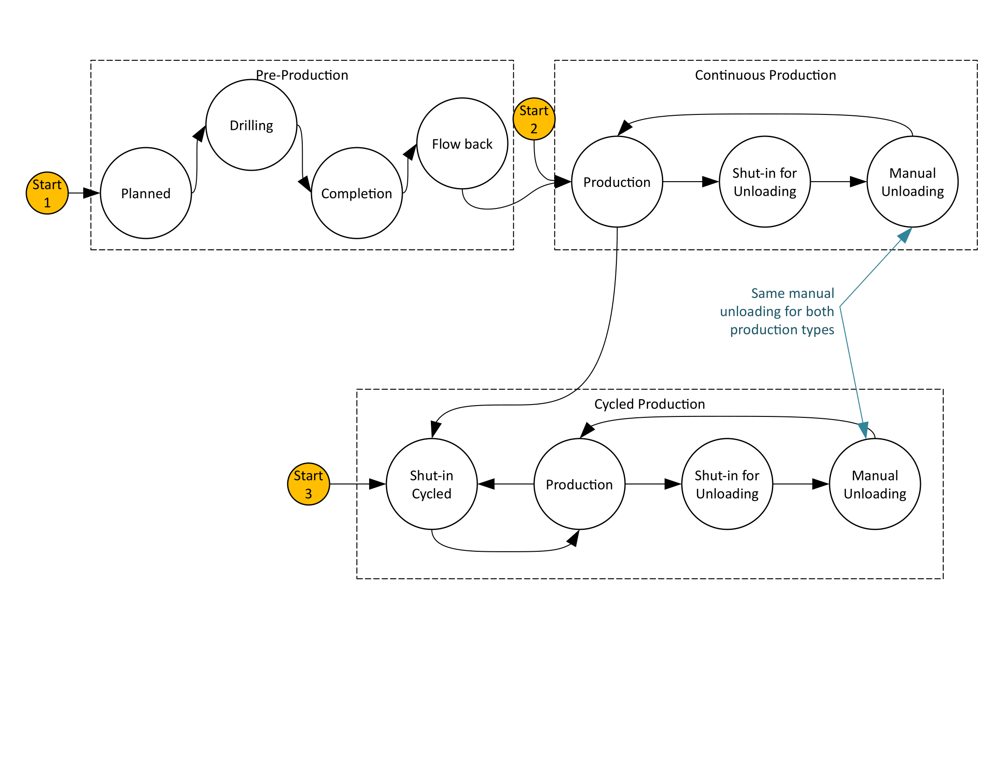

Wellhead with constant production
=================================

Model Filename: Well.json

Continuously producing wells

States
------

PLANNED
  Planning stages for wellhead

DRILLING
  Drilling specific wellhead

COMPLETION
  Well drilling is completed

FLOW_BACK
  Well is in flowback stages

PRODUCTION
  Well is in steady production

MANUAL_UNLOADING
  Manual unloading for wells

AUTOMATIC_UNLOADING
  Automatic unloading for wells

LU_SHUT_IN
  Shut in for unloading

Fluid Flows
-----------

Condensate
  Primary Condensate flow

Water
  Primary Water flow

Site Definition Columns
-----------------------

**Facility ID**
  Facility of the equipment

**Unit ID**
  Identity of the equipment

**Latitude**
  Latitude of the physical location of the facility / wellpad

**Longitude**
  Longitide of the physical location of the facility / wellpad

**Oil Production**
  Rate of oil production per day from a well

  *Units:* bbl/day

**Water Production**
   Rate of water produced per day from a well

**Di per month**
  Parameter for decline curve (not yet implemented)

**b Hyperbolic**
  Parameter for decline curve (not yet implemented)

**Age months**
  Parameter for decline curve (not yet implemented)

**Completion Durations Name**
  A curated data file that specifies the distribution of well completion durations

**Optional Unloading**
  A Boolean variable [True/False] that specifies if we want to simulate well-unloading. Defaulted to False. Setting this parameter to False will nullify all the unloading parameters, i.e. 'Min Time Between Unloadings', 'Max Time Between Unloadings', 'Unloading Type', 'Weekdays Only', 'LU Shut-In Duration Mim', 'LU Shut-In Duration Max', 'Unloading Duration Min', 'Unloading Duration Max' and 'Destination of Unloading Gas'.

  *Units:* True/False

**Approx Delay After Completion**
  Approximated buffer time after well completion in days. The simulation will pick a random value uniformly distributed within a 20% window around the time specified.

  *Units:* days

**Min Time Between Unloadings**
  Minimum time in days between unloadings.

  *Units:* days

**Max Time Between Unloadings**
  Maximum time in days between unloadings. The simulation will pick a uniformly distributed random value between min and max. 

**Unloading Type**
  Specifies whether the unloadings are automatic or manual. This parameter should only be specified if 'Optional Unloading' is 'True'. The parameter is defaulted to 'Manual' when we chose not to specify.

  *Units:* Automatic/Manual

**Weekdays Only**
  Specifies whether the unloadings are happening on weekends or weekdays. True for weekdays only, False for weekends

  *Units:* True/False

**LU Shut-In Duration Min**
  Minimum liquid-unloading shut in duration in hours

  *Units:* hours

**LU Shut-In Duration Max**
  Maximum liquid-unloading shut in duration in hours

  *Units:* hours

**Unloading Duration Min**
  Minimum unloading duration in hours

  *Units:* hours

**Unloading Duration Max**
  Maximum unloading duration in hours

  *Units:* hours

**Destination of Unloading Gas**
  Destination (unitID) of gas that is released during unloading (not implemented)

**Approx Planning Time**
  Approximate duration for planning

  *Units:* days

**Approx Delay After Planning**
  Approximate duration of the buffer time after planning and before drilling

  *Units:* days

**Approx Drilling Time**
  Approximate duration for drilling

  *Units:* days

**Approx Delay After Drilling**
  Approximate duration of the buffer between drilling and flow-back stage

  *Units:* days

**Approx Flow Back Time**
  Approximate Flow back duration

  *Units:* days

**Approx Delay After Flow Back**
  Approximate buffer time after flowback and before production starts.

  *Units:* days

**Simulation Start Stage**
  Specifies the initial state of the simulation. Default value is Production. Setting this parameter to Production will keep the simulation in the production stage for all of simulation duration. We do not need to specify the preproduction columns ('Completion Durations Name', 'Approx Delay After Completion [days]', 'Approx Planning Time [days]', 'Approx Delay After Planning [days]', 'Approx Delay After Planning [days]', 'Approx Delay After Planning [days]', 'Approx Delay After Drilling [days]', 'Approx Flow Back Time [days]', 'Approx Delay After Flow Back [days]') in this case. Setting it to PreProduction, the simulation will start at Planning state and follow from there. All the approx. values are uniform random variables with a +- 20% window from the specified time

  *Units:* PreProduction, Production

**Flow Tag**
  Specifies an identity to match it with the correct gas composition in the gas composition file

**Flow Gas Composition**
  The gas compositions file associated with the well

Emitters
--------

**Completion**
  Emitter Category: COMPLETION
  
  Emission Category: VENTED
  
  Model Parameters:
  

    **Factor Tag**
      A parameter to identify a set of activity and emission factors in Factors.csv file

    **Leak GC Name**
      Gas composition pointer for leaks based on pLeak, MTTR, MTBF

**Wellhead Component Leak**
  Emitter Category: COMPONENT LEAK
  
  Emission Category: FUGITIVE
  
  Model Parameters:
  

    **Component Leak Survey Frequency**
      Frequency of leak surveys (ex. LDAR)

      *Units:* days

    **Component Count**
      Component counts of all the equipment that can leak

    **Component pLeak**
      Probability of leak of the number of components leaking at any time

    **Factor Tag**
      A parameter to identify a set of activity and emission factors in Factors.csv file

    **Leak GC Name**
      Gas composition pointer for leaks based on pLeak, MTTR, MTBF

**Wellhead Pneumatic Emissions**
  Emitter Category: PNEUMATIC EMISSION
  
  Emission Category: VENTED
  
  Model Parameters:
  

    **Leak GC Name**
      Gas composition pointer for leaks based on pLeak, MTTR, MTBF

    **Factor Tag**
      A parameter to identify a set of activity and emission factors in Factors.csv file

    **Actuator Type**
      Actuator type of pneumatics on the facility

      *Units:* Gas, Air, Electric

.. include:: reference/ContWellRef.rst
