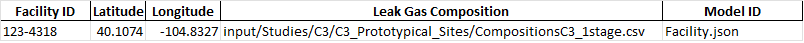
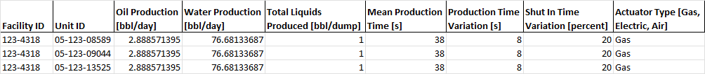
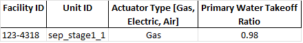
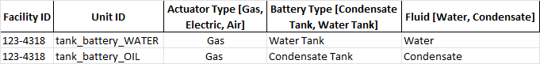
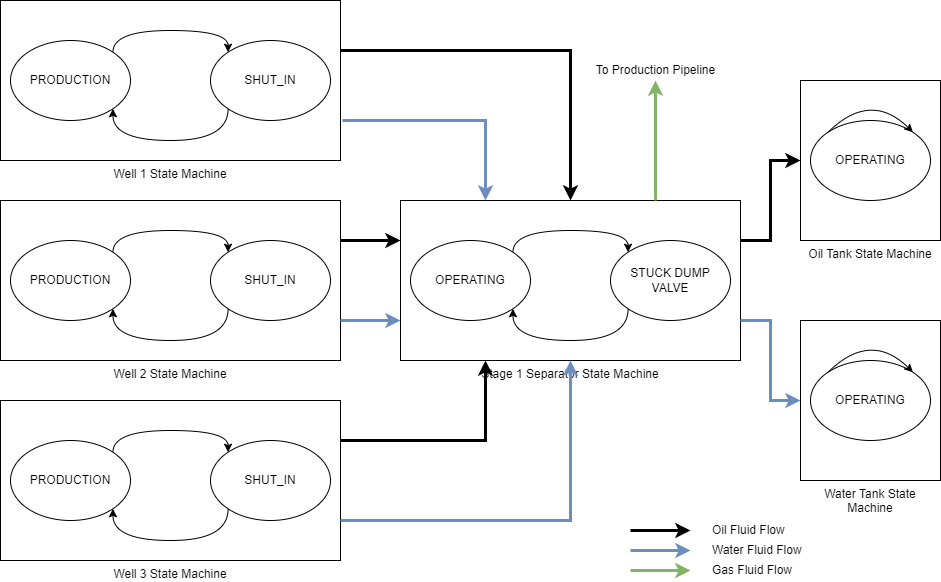
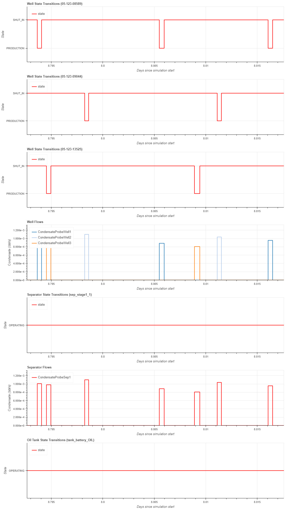

MEET Simulation Example
=======================

.. figure:: graphics/p1_1stage_noflare.png

   Example site -- 3 wells, 1 separator stage
   

The site definition file C3/C3_Prototypical_Sites/P1_1stage_noflare.xlsx defines a small site with three wells feeding into a single stage of separation.
Gas from the separator goes into the production pipeline; water and oil from the separator goes into water and oil tanks, respectively.
The wells produce on a periodic basis -- each well will be in a shut in until it produces fluid that goes into the separator.  The separator operates continuously.

The site definition file is an excel file with a number of tabs -- more detail on the general definition of this file can be found in :ref:`site_definition_label`.

   Facility Tab
   
The facility tab defines the overall facility which contains equipment.  Multiple facilities can be defined in a single site definition file.  
The facility defines default values for latitude & longitude, and a default gas composition for leaks.

   Cycling Wells Tab Production Fields
   
The Cycling Wells tab defines parameters relating to well production, leaks, and associated pneumatics (specifics on all the columns :

* **Facility ID** -- the Facility ID column identifies which facility the well belongs to.

* **Unit ID** -- the Unit ID column uniquely identifies the well within the facility.

* **Oil Production** -- The Oil Production column defines how much oil is produced by the well, in barrels per day.

* **Water Production** -- the Water Production column defines how much water is produced by the well, in barrels per day.

* **Total Liquids Produced** -- The Total Liquids Produced defines how many barrels are produced per dump.

* **Mean Production Time** and **Production Time Variation** -- defines the length of time the well is producting -- Mean Production Time plus a random number chosen from a random distribution between (-Production Time Variation, Production Time Variation).

* **Shut In Time Variation** -- provides a random factor to vary the amount of time betwen productions.

For each dump, the production time is calculated by choosing a production time variation, and adding it to the Mean Production Time.  The the total production is calculated by adding the Oil Production rate and the Water Production rate.  This will cause a production event where the total production is dumped over the total production time.  To get a production rate, the total production is divided by the production time.

For example, given the parameters above, the Mean Production Time is 38s +- 8s, or a random number between 30s & 46s.  For this example, assume 40s.  The total production is 2.88 bbl/day of Oil and 76.68 bbl/day of Water, for a total of 79.56 total barrels of fluid produced per day.  This is divided by Total Liquids Produced (1 bbl/dump), which gives 79.56 dumps/day.  Each dump is 1 bbl, so for this dump rate is 1 bbl / 40 s = 0.025 bbl / s.  Given that there are 79.56 barrels produced per day, there will be 79.56 dumps per day.

   Separator Tab
   
The separator is a continuous separator, which means fluid is passed through the separator as it enters.

   Tank Battery Tab

There are two tanks on this facility, one for Oil (Condensate) and one for Water.

MEET State Machines
-------------------

A *state machine* is a mathematical model of system behavior.  The system can be in exactly one of a finite number of states at a given time, and can change from one state to another in response to inputs to the system.  The system will always be in one of the states.  A state change is also called a *transition*, and transitions are assumed to happen instantaneously.
An important property of state machines is that their operation depend only on the value of the state variables and external inputs -- never on what happened in a previous state.

In MEET, states have a *duration*, that is, the amount of simulation time spent in the state.  State duration is typically defined in the site definition file, either as a single value or a distribution.  In the former case, the single value is always used as a duration; in the latter case a number is picked from the distribution each time the state is entered.

Coupling State Machines with Fluid Flows
~~~~~~~~~~~~~~~~~~~~~~~~~~~~~~~~~~~~~~~~

   Coupled State Machines with Fluid Flows

The above diagram shows the example site with the state machines for each piece of equipment.  Timing for the well state transitions are defined in the site definition file, and the state timing defines the timing of the fluids passed across the fluid flow links.  The separator is a continuous separator, which means that its flows are driven by the input flows.  Note that the state timing is generally independent from the fluid flow timing -- while the separator is in the OPERATING state most of the time, the fluid flows it emits still vary in time.

   Example Simulation Run

As an example, consider the above diagram.  It shows a zoomed in time period to illustrate four well production cycles.  Note that the cycles have different durations and shut-in times.  The flows out of the wells are also illustrated, and shows "pulsing" behavior of the condensate going into the separator.  The separator is in a single state, OPERATING, for the entire duration of this example, and the output of the separator shows the aggregated flows from the three well inputs.  This flow goes into the tank, and it is in the OPERATING state except for certain times when then input condensate causes an OVERPRESSURE_VENT.

Secondary Fluid Flows
~~~~~~~~~~~~~~~~~~~~~

The fluid flows in the above diagram describe the main flows of the process, and are called the primary fluid flows.  Secondary fluid flows are used to "route" fluids to equipment in the case of failure modes.  For example, when the tank battery is in OPERATING state, any vapor created via flash is routed through the primary fluid flow.  When it isin OVERPRESSURE_VENT state, the vapor is routed to the secondary fluid flow 'tank_flash_emitted_gas', which generally goes to an emitter or can go to a downstream flare.

Emissions
---------

There are three types of emitters in MEET:

* **Non-Mechanistic Emitters** are derived soley activity factors and emission factors.  They do not preserve mass balance.  Examples include leaks, pneumatics, and special large emitters.

* **Partially Mechanisitc Emitters** are derived by a quantity other than fluid flows.  They do not preserve mass balance.  An example is combustion exhaust from a compressor, which is derived from the load on the compressor, which is itself derived from input parameters on the site definition sheet.

* **Fully Mechanistic Emitters** are derived from a fluid flow coming into the equipment.  They preserve mass balance.  Examples include stuck dump valve emissions and combustion emitters on flares.

What does it mean for an emitter to preserve mass balance?  In theory, the mass of all of the fluids coming into a facility from wells should be the same as the mass of all outbound fluid flows plus the mass of all emissions.  In other words:

.. math:: \sum_{}^{}{{ff}_{i} = \ \sum_{}^{}{{ff}_{o} + \ \sum_{}^{}e}}

Emitters that do not preserve mass balance violate this equation -- the emissions are "made up" and are not bound to a particular flow.  The reason for this is that it is often very difficult to identify which flow is the driver for an emission, and for purposes such as Leak Detection and Repair analysis, it is more important to have the emissions than it is for the mass balance to be preserved.

State Dependent Emissions
~~~~~~~~~~~~~~~~~~~~~~~~~

All three emission types (Non-Mechanistic, Partially Mechanistic, and Fully Mechanistic) can be defined to be dependent on the state of the equipment they are associated to.  In this case, the model developer specifies in which state the emitter will be active, and the emissions occur while the equipment is in that state, and are zero otherwise.

Gas Compositions -- Converstion from Emission Factor and Fluid Flow Units to Gas Species
~~~~~~~~~~~~~~~~~~~~~~~~~~~~~~~~~~~~~~~~~~~~~~~~~~~~~~~~~~~~~~~~~~~~~~~~~~~~~~~~~~~~~~~~

Emission factors and fluid flows are specified in units, typically barrels per second or standard cubic per second.  These are generically called driver units.  In order to be useful, emissions are expressed in kilograms per second for each gas species produced.  The translation of an emission from driver units to speciated emissions is defined in the Gas Composition file.  See :ref:`GC-label`.

Interpreting the Results
------------------------

To run the above example, go to the MEET installation directory and run:

python src/MEETMain.py -s C3/C3_Prototypical_Sites/P1_1stage_noflare.xlsx

in an anaconda window.  By default, simulation output will go to the timestamped directory output/P2_1stage_noflare/MC_YYYYMMDD_HHmmss, where *YYYY* is the year, *MM* is the month, *DD* is the day, *HH* the hour, *mm* is the minute and *ss* is the second.  In this directory will be individually numbered directories corresponding to Monte Carlo runs.

MEET creates several output files in this directory, including three summary files:

* **summaryState.csv** contains timing information for how long each major equipment is in each of its states.

* **summaryFluidFlow.csv** contains summary fluid flows for each probe.

* **summaryEmissions.csv** contains emission information for each emitter, by species.

More information on the content of these files can be found at :ref:`file_format_label`.

The summary files provide data at the most basic level, and more processing can be used to make the results more useful.  For example, the summaryEmissions.csv file contains gas species by emitter.  The emitters have additional metadata attached to them which can be used for further summarization.  For example, to summarize the emissions by model category:

.. code-block:: python

   import pandas as pd

   emissionDF = pd.read_csv("summaryEmission.csv")
   emissionByModelCategoryDF = emissionDF.pivot_table(values=['totalMass', 'massUnits'],
                                                      index=['modelCategory', 'species'],
                                                      aggfunc={'totalMass': 'sum', 'massUnits': 'first'})
   emissionByModelCategoryDF = emissionByModelCategoryDF.reset_index()
   emissionByModelCategoryDF.to_csv("summaryEmissionByCategory.csv", index=False)

