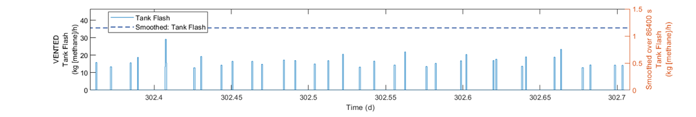

Mechanistic Emission Emulation Tool (MEET)
==========================================

The Methane Emissions Estimation Tool (MEET) is a computer model built to simulate methane and other hydrocarbon emissions from the onshore natural gas industry over a specific period of time.  The model can estimate emissions from either a single facility or multiple facilities in a geographic area.  Emissions are estimated using data from published research, or from custom data entered by the user.  Industry segments in the model include onshore natural gas production, gathering and boosting, gas processing, and transmission and storage. 

Emissions from natural gas operations are inherently stochastic and dependent on several unknown variables. For this reason, the MEET model uses Monte Carlo methods to determine a range of possible emissions values over the study period. This means that for a typical use case the model will run a number of iterations (i.e., Monte Carlo runs) to determine the most likely emissions scenarios.

MEET differs from traditional inventory methods by providing a fine-grained temporal and geographic resolution to its simulation results -- emission events are modeled to a one-second granularity, and each emission event is associated with specific geographic coordinates.  This resolution provides much richer comparison of emission detection methods, leak detection and repair programs, and basin-level analysis than previous solutions.

Temporal Resolution
-------------------

  Tank Flash emission events vs. mean emissions
  
The above figure shows the value of fine-grained temporal resolution.  On the left axis, illustrates typical tank flashing behavior and timing, where methane is released from the fluid in the tank.  The timing is defined by incoming fluid from upstream equipment, presumably a separator.  The left axis shows the mean emissions over a single day.  While a typical tank flash event is in the range of approx. 15 - 30 kg/h, the mean is approx. 1.2 kg/h.  At no time during the day does a tank flash at the mean rate.

Getting Started
---------------
.. toctree::
   
   gettingStarted
   usage
   example
   

Reference
---------
.. toctree::

   ModelReference/index

   FileReference/index
   
   PhysicalProcesses/index

